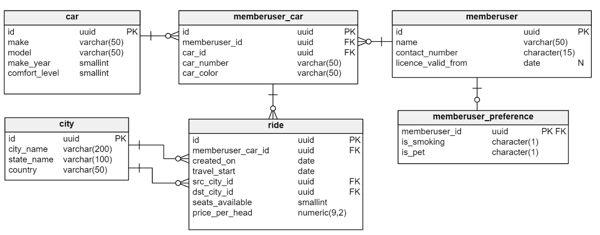

# Carpooling DB with dataset
- car: 5
- city: 200
- memberuser: 9000000
- memberuser\_car: 1500000
- memberuser\_preference: 2999990
- ride: 3000000

Created Indexes:
CREATE INDEX idx\_fk\_mu\_id ON memberuser\_car (memberuser\_id);
CREATE INDEX idx\_fk\_car\_id ON memberuser\_car (car\_id);
CREATE INDEX idx\_fk\_mu\_car\_id ON ride (memberuser\_car\_id);
CREATE INDEX idx\_fk\_src\_city\_id ON ride (src\_city\_id);
CREATE INDEX idx\_fk\_dst\_city\_id ON ride (dst\_city\_id);
CREATE INDEX idx\_car\_make ON car (make);

CREATE INDEX idx\_city\_state\_name ON city (state\_name);

---

# The Final Data Model

